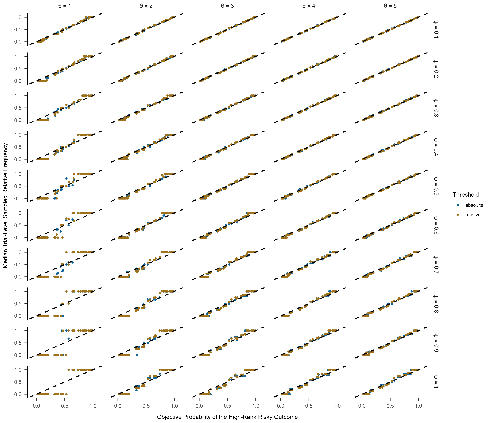
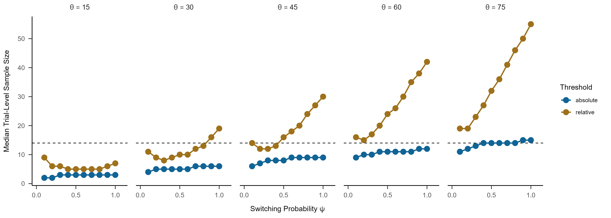
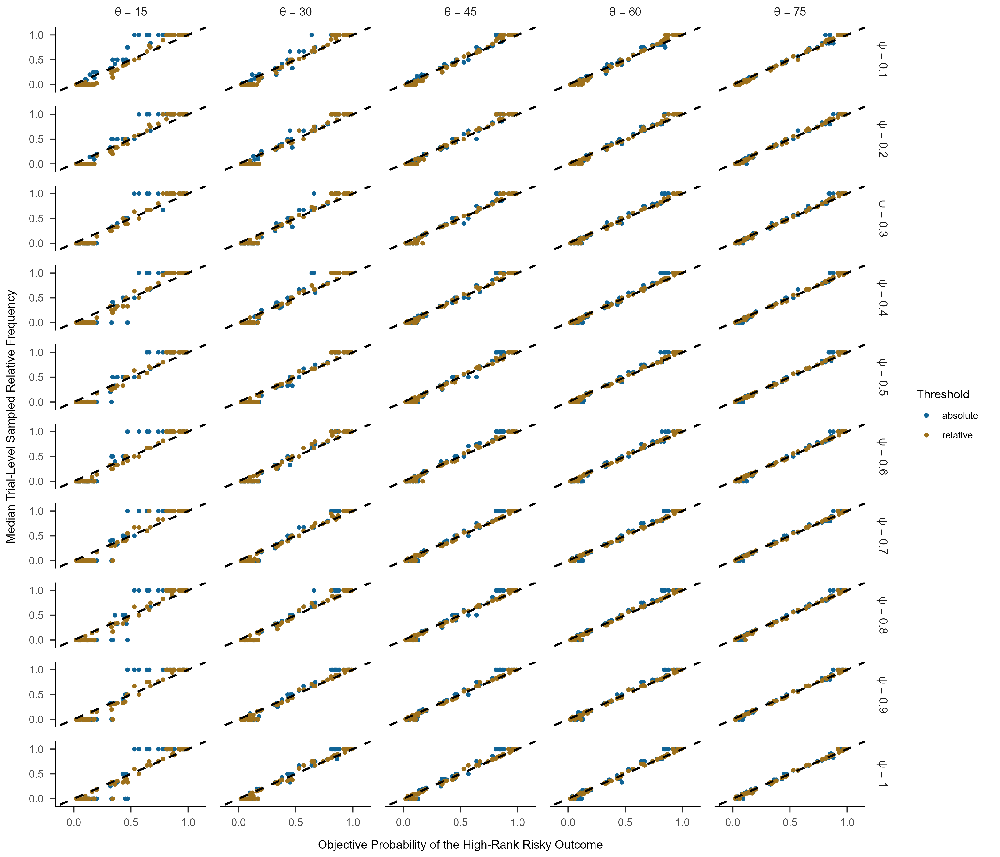
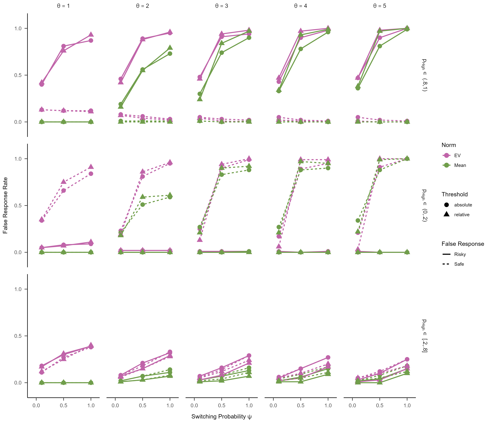
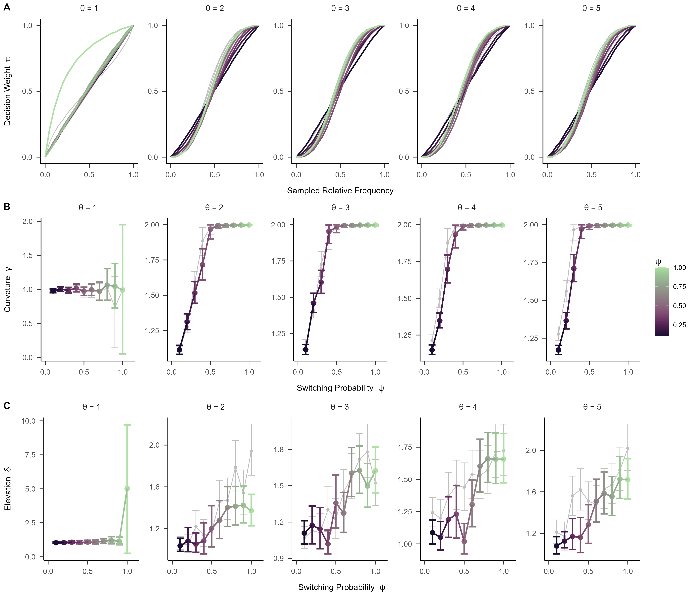
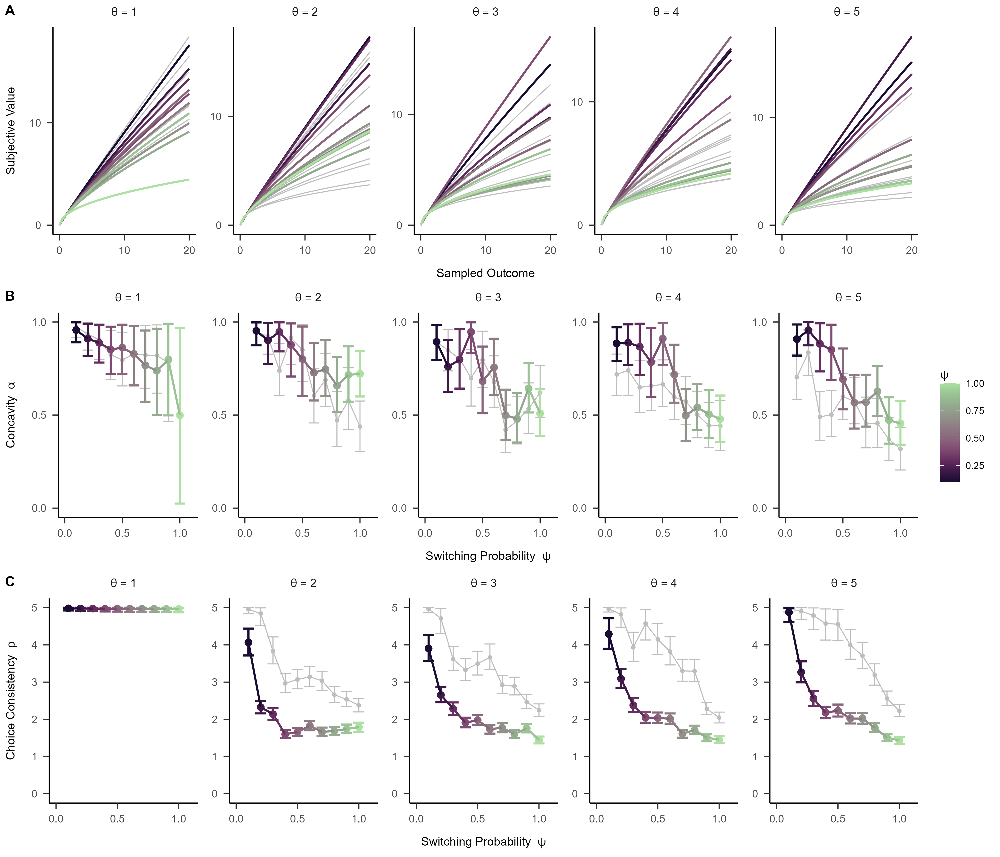

# Description and Remarks

For conceptual and methodological details, e.g., on sampling and
integration strategies and there computational implementation, please
refer to the <!--submitted -->manuscript<!--link document-->. This
report covers the comprehensive data analyses underlying the core
results reported in the manuscript. The analyses comprise of the
description and explanation of the sampling and choice behavior
exercised by the roundwise and summary integration model and their
parameters, as well as their translations into the psychoeconomic
functions of cumulative prospect theory (CPT).

The results of the analyses, particularly the reported choice rates and
CPT estimates, can be understood as theory-implied data, or predictions,
that remain to be tested against empirical data.

If you feel you spotted an error/bug/etc. in the analyses—or any other
part of this project—or in the case of questions and remarks, please add
an issue to this repository or contact the author.

# Summary of the Core Results

-   The interplay of sampling and integration strategies can produce
    distinct choice patterns in decisions from experience.

-   These choice patterns translate into characteristic shapes of CPT’s
    value and weighting function. This suggests that psychoeconomic
    representations of experienced-based choices can reflect an agent’s
    strategic response to core tasks involved in the underlying
    decision-making process, i.e., information search, stopping, and
    information integration.

-   Both strategy-implied choice patterns and their psychoeconomic
    translations arise in the absence of sampling error.

-   The roundwise integration of sampled outcomes can cause the typical
    as-if underweighting of rare outcomes pattern in decisions from
    experience, challenging the common frugal-sampling explanation.

# Sampling Behavior

In experience-based choices, the sampled information tends to deviate
from the latent information because the samples are not infinitely
large. That is, the sampled relative frequencies of outcomes often do
not match the objective probabilities. This sampling error need not be
purely random. Specifically, the smaller the sample, the more positive
the skewness of the binomial distribution of small-probability outcomes.
In such cases, then, the respective outcomes tend to be undersampled
rather than oversampled. This sampling error can produce systematic
deviations from expected value (EV) or expected utility (EU)
maximization that take the form of an as-if underweighting of rare
outcomes pattern (Fox & Hadar,
[2006](https://psycnet.apa.org/record/2007-04382-008)).

Given the impact of small samples, this section reports the sample sizes
and sampled relative frequencies produced by the models. However, the
main objective of the analyses is to demonstrate that the interplay of
sampling and integration strategies can affect the choice behavior
irrespective of the existence or absence of sampling error. Thus,
further below, in the sections on choice behavior and the CPT estimates,
sampling error is controlled for.

## Roundwise Integration Model

The following figure displays the number of outcomes sampled within
choice trials (trial-level sample sizes), the scale on which sampling
error is commonly considered. Each point represents the median across
all trials given the respective parameter combination. The dashed
horizontal line represents the meta-analytic median reported by Wulff et
al. ([2018](https://psycnet.apa.org/doiLanding?doi=10.1037%2Fbul0000115))
for choices between a two-outcome risky prospect and a safe prospect.

-   The **trial-level sample sizes increase with decreasing switching
    probabilities and increasing thresholds**.

-   For some combinations of switching probabilities and thresholds, the
    **sample sizes approximate the meta-analytic mean** found by Wulff
    et
    al. ([2018](https://psycnet.apa.org/doiLanding?doi=10.1037%2Fbul0000115)).
    The respective combinations - i.e., high switching probabilities and
    high thresholds - were elsewhere assumed to relate closely to the
    roundwise integration strategy (see Hills & Hertwig,
    [2010](http://journals.sagepub.com/doi/10.1177/0956797610387443)).
    In contrast, low (high) switching probabilities and large (small)
    thresholds produce sample sizes that are considerably larger
    (smaller) than the meta-analytic median.

<!-- Discussion Note. 
Assuming that people make systematic choices based on true differences in the latent properties of the alternatives, then whatever property is used may be accurately inferred with the meta-analytic derived sample size of about 14. 
One might reverse-engineer what property that is depending on the model and parameter combinations.
-->

The following figure shows how small trial-level sample sizes lead to
larger deviations of the trial-level sampled relative frequencies from
the objective probabilities (sampling error). Each point represents the
median across all trials for the respective objective probability and
parameter combination.

Following from the laws of large numbers, the relative frequencies
within a (very) large sample almost surely converge to the objective
probabilities. Thus:

-   **For low switching probabilities, trial-level sampled relative
    frequencies tend to match the objective probabilities more closely
    than for high switching probabilities** (vertical grid dimension,
    read from top to bottom). Because of the positive skewness of their
    binomial distribution, small-probability outcomes are then more
    often undersampled than oversampled.

-   **For high thresholds, trial-level sampled relative frequencies
    match the objective probabilities more closely than for low
    thresholds** (horizontal grid dimension, read from left to right).

The following plot demonstrates that the inverse relationship between
switching probabilities and trial-level sample sizes is driven by the
inverse relationship between switching probabilities and round-level
sample sizes, i.e., the number of outcomes sampled within a single
comparison round. Each point represents the median round-level sample
sizes across all rounds for the given parameter combination.

-   The **round-level sample sizes decrease with increasing switching
    probabilities**.

-   Thresholds do not affect the round-level sample size. However,
    increasing thresholds naturally lead to a proportional increase of
    the trial-level sample size.

The roundwise integration mechanism implies that the relative
frequencies sampled on the round level can themselves deviate from the
relative frequencies sampled on the trial level. The figure below
displays their relation.

-   For *θ* = 1—i.e., when only one mean comparison is carried out—the
    relative frequencies sampled on the round level are necessarily
    identical to those sampled on the trial level.

-   For *θ* \> 1, however, increasing switching probabilities cause the
    relative frequencies sampled on the round level to deviate from the
    relative frequencies sampled on the trial level. In other words,
    **with increasing switching probabilities and decreasing round-level
    sample sizes, the round-level samples become less representative of
    the trial-level sample**. Because of the positive skewness of their
    binomial distribution, then, **small-probability outcomes tend to be
    undersampled on the round-level relative to their sampled
    frequencies on the trial level**. This effect is naturally amplified
    for large thresholds.

-   Consequentially, for high switching probabilities, small-probability
    outcomes are expected to contribute to the majority of the mean
    comparisons less than would be warranted by both their latent
    objective probabilities and their relative frequencies sampled on
    the trial level. Now, because sampling error is usually controlled
    for on the trial level, **the mechanisms of the roundwise model can
    produce an as-if underweighting of rare outcomes pattern, even if
    sampling error is controlled for**. **This pattern should in fact
    become more stable with increasing thresholds and thus increasing
    trial level sample sizes**. This prediction is rather different from
    the common assumption that the as-if underweighting of rare outcomes
    pattern is due to the small number of outcomes sampled prior the
    final choice.

## Summary Integration Model

The following figure displays the trial-level sample sizes for the
summary integration model. Each point represents the median across all
trials for the respective parameter combination. The dashed horizontal
line again represents the meta-analytic median reported by Wulff et
al. ([2018](https://psycnet.apa.org/doiLanding?doi=10.1037%2Fbul0000115)).
An analysis of the round level is not applicable for the summary
integration model.

-   For relative thresholds, the trial-level sample sizes increase with
    switching probabilities. This effect is caused by **random temporal
    imbalances between the prospects for small switching
    probabilities**, which are introduced by the method of
    implementation (use of cumulative sums rather than cumulative
    means). Specifically, the evidence accumulation process—i.e., the
    sampling and summation of outcomes—starts at random on one of the
    prospects, providing the starting prospect with a temporal advantage
    over the other just because its accumulated evidence tends to be
    based on a larger sample at a given point in time. The smaller the
    switching probability, the larger this random temporal advantage.
    These **random temporal imbalances must be taken into account when
    interpreting the choice data and CPT estimates for the summary
    integration model.**

-   The **temporal imbalances have severe effects on the number of
    sampled outcomes for relative thresholds** but not for absolute
    thresholds. This is because, for absolute thresholds, the number of
    outcomes that must be sampled from a *given* option in order for it
    to reach a threshold is not affected by the switching probability.
    In contrast, **the lower the switching probability and thus, the
    larger the temporal imbalances between options, the less outcomes
    must be sampled from the advantageous prospect for it to reach the
    relative threshold**.

-   For both absolute and relative thresholds, increases in the
    threshold naturally lead to proportional increases in the total
    number of samples.

Below, it is shown how the sampled relative frequencies of outcomes
match the objective probabilities.

-   The **sampled relative frequencies match the objective probabilities
    more closely the higher the thresholds are**. This is because higher
    thresholds require larger sample sizes.

-   For relative thresholds, a pattern opposite to that of the roundwise
    integration model emerges. That is, **for high switching
    probabilities, sampled relative frequencies tend to match the
    objective probabilities more closely** than for low switching
    probabilities. This is because the total number of sampled outcomes
    decreases with switching probabilities and vice versa. Again,
    because of the positive skewness of their binomial distribution,
    small-probability outcomes then tend to be underrepresented rather
    than overrepresented the majority of times.

-   For absolute thresholds, switching probabilities have no effect on
    the relative sampled frequencies.

# Choice Behavior

In this section, the choice patterns produced by the models and
parameter combinations are reported in terms of deviations from EV
maximization and sampled mean maximization. Specifically, for each model
and parameter combination, the plots below display the rates of choices
that did *not* maximize the latent EV or the sampled mean (false
response rates). Deviations from sampled mean maximization control for
sampling error on the trial level because the sampled means take all
sampled information into account but not more. If the sampled
information deviates from the latent information, this is reflected in
deviations of the sampled mean from the latent EV.

The false response rates are reported separately for the existence and
rank of the small-probability outcome of the risky prospect and for the
type of the false response (false risky or false safe). This is because,
depending on the rank of the small-probability outcome, sampled means of
the risky prospect on the trial level (round level) can either be
inflated or deflated in or against the direction of the differences in
the latent EV (sampled means on the trial level). Whereas inflation and
deflation in the direction of the EV and trial-level mean difference
should produce choice patterns consistent with maximization, inflation
and deflation in the opposite direction should produce inconsistent
choice patterns and thus higher false response rates.

## Roundwise Integration Model

-   For **small-probability outcomes of low rank, the rates of false
    risky choices increase with the switching probability**, whereas the
    rates of false safe choices remain low (top row). Vice versa, for
    **small-probability outcomes of high rank, the rates of false safe
    choices increase with the switching probability**, whereas the rates
    of false risky choices remain low (middle row).

-   Both patterns, similar in structure, can be explained by the inverse
    relationship between switching probabilities and round-level sample
    sizes, the positive skewness of small-probability outcomes in small
    samples, and the independence of comparison rounds. That is, **for
    high switching probabilities, small-probability outcomes tend to be
    undersampled within each comparison round, causing the respective
    outcome to contribute less to the majority of the mean comparisons
    than would be warranted by both its objective probability and the
    sampled relative frequency on the trial level**. In other words, if
    the low (high) rank outcome is of low probability, the mean of the
    risky prospect tends to be inflated (deflated) compared to the
    latent EV and the trial-level mean in the majority of comparison
    rounds. Because each mean comparison is independent and weighted
    equally, there is, in turn, a higher chance that the risky prospect
    is falsely chosen (dismissed) and this chance increases with
    switching probabilities and thresholds.

-   The effect of total sampling error is represented by the color
    coding. **False response rates tend to be higher if compared to
    latent EV maximization instead of the sampled mean maximization**,
    where the latter controls for sampling error. Sampling error causes
    the sampled relative frequencies to deviate from the objective
    probabilities both unsystematically (random random) and
    systematically (systematic underrepresenation of small probability
    outcomes). With **increasing thresholds and thus an increasing
    number of sampled outcomes, sampling error is reduced as is
    reflected by the convergence of the two EV and mean lines**. The
    similarity of the curve-pairs demonstrates that **the interplay
    between sampling and integration strategies can have a nuanced and
    severe effect on the choice behavior beyond sampling error**.

-   For choice problems with no small-probability outcomes, false
    response rates increase with switching probabilities, however, on a
    lower level. Together with the reversed choice patterns for problems
    that contain desirable rare outcomes on the one hand and undesirable
    rare outcomes on the other hand, this shows that the structure of
    the environment (choice problems) plays an important role for the
    roundwise integration model to produce normative or non-normative
    choice behavior.

<!-- Discussion Note.
How robust are the analyses to changes in the choice problems, e.g., multiple outcomes, mixed prospects, etc.?
-->

## Summary Integration Model

-   **False response rates are transitioning from random choice behavior
    at rates around .5 for low switching probabilities to a systematic
    maximization of the sampled mean and the latent EV for high
    switching probabilities**. This decrease in the false response rates
    can be explained by diminishing random temporal imbalances and the
    ability of the summary integration model to approximate the
    solutions of mean and EV maximization, given that roughly the same
    large number of outcomes is sampled from *both* prospects.

-   **For low switching probabilities, the summary integration model
    tends to choose the prospect that is, by chance, first sampled
    from** due to the temporal advantage this prospect obtains (i.e.,
    the cumulative sum of the starting prospect is based on a larger
    sample at most times).

-   The temporal imbalances diminish with increasing switching
    probabilities—yet, they may not fade entirely—since here cumulative
    sums are based on roughly the same underlying sample size at any
    point in time. The **rates of sampled mean and EV maximization then
    increase with switching probabilities because the differences in the
    cumulative sums are proportional to the difference in sampled
    means**, given equal sample sizes.

-   Similar to the sample mean, the effect of sampling error should be
    larger for small samples. However, the sampling error and changes
    thereof are not easily discernible from the plots, specifically,
    from the difference between the mean and the EV line. This is
    because **for small switching probabilities, the effect of sampling
    error is overshadowed by the random temporal imbalances**. That is,
    as no systematic choices are made, deviations from the sampled mean
    and the latent expected value should be equally random.

# CPT and Logit Choice Rule

In this section, the estimates for the parameters of CPT and the logit
choice rule are reported. CPT is a descriptive model of risky and
uncertain choice that describes deviations from EV maximization by
subjective transformations of outcomes and probabilities carried out by
a value and a weighting function, respectively. Here, to control for
sampling error, the trial-level sampled relative frequencies were
supplied as probability information to CPT’s weighting function.

CPT was amended with a stochastic (rather than a deterministic) choice
rule to allow for variations in the degree to which the choice
predictions are consistent with the strength of preference derived from
the evaluations of the core CPT model.

The fitted models were only considered for analysis if the scale
reduction factor *R̂* for all their parameters was below ≤ 1.01. All
scale reduction factors were *R̂*≤ 1.008, indicating acceptable
convergence of all models.

For further details on the method, please refer to the manuscript.

## Roundwise Integration Model

### Weighting Function

The plot below displays the means and 95%-intervals of the posterior
distributions of the curvature parameter *γ* and the elevation parameter
*δ*, as well as the resulting graphical shape of the weighting function.

-   For the parameter combination (*θ* = 1, *ψ* = 1) of the generative
    model, the 95%-intervals of the posterior distributions of *γ* and
    *δ* are large. Here, no sampled relative frequencies other than 0
    and 1 are supplied to the weighting function, which suggests that
    the function cannot reliably account for the relative frequencies in
    between. This can explain the high uncertainty about the parameters
    of the weighting function in this case.

-   **For the parameter combinations (*θ* = 1, *ψ* \< 1), the estimates
    imply a linear weighting pattern, i.e., *γ* ≈ 1 and *δ* ≈ 1**. This
    is because only a single mean comparison is carried, therefore
    causing the roundwise integration model to always choose the
    prospect that produces the larger mean (EV maximization). This
    result is well in line with the explanation that if the mind were to
    infer the latent objective probabilities of outcomes from the
    sampled relative frequencies and to follow the principle of EV
    maximization, sampling error can account for any deviations from it.
    This is also demonstrated by the false response rates displayed
    above, where there are no choices for *θ* = 1 that do not maximize
    the sampled mean.

-   For *θ* \> 1, **the estimates of the curvature parameter *γ* take
    values  ≥ 1 and increase with switching probabilities**. **This, in
    turn, results in a increasingly pronounced S-shaped weighting
    function**. In other words, the higher the switching probability,
    the more severe is the underweighting (overweighting) of the
    high-rank outcome of the risky prospect in CPT, if it is of small
    (large) probability. That is, **the as-if underweighting of rare
    outcomes pattern indicated by the final choices (i.e., the false
    response rates) translates rather directly to an underweighting of
    small-probability outcomes in CPT**. However, for switching
    probabilities around .5, the *γ*-estimates already reach the upper
    boundary of the parameter range specified in the prior probability.
    This indicates that, given a higher parameter boundary, the *γ*
    estimates for switching probabilities  ≥ .5 may be larger. In other
    words, the parameter range of *γ* ∈ \[0,2\] may not suffice to
    account for all the model-implied variance in the choice data.

-   For *θ* \> 1, **the estimates of the elevation parameter *δ* take
    values  \> 1 and increase slightly with switching probabilities**.
    **This, in turn, results in an overweighting of the high-rank
    outcome of the risky prospect that extends across the mid-point of
    the probability scale**. It is open for discussion whether this
    overweighting-extension beyond the mid-point is theoretically
    implied by the mechanisms of the roundwise integration model: That
    is, for high switching probabilities, the model is expected to
    choose the risky prospect most of the time, if the probability of
    its high-rank outcome is  \> .5. To account for the resulting choice
    behavior, CPT might overweight high-rank outcomes with a probability
    far larger than .5 less severely than high-rank outcomes with a
    probability only a little larger than .5. Such a pattern is implied
    for *δ* \> 1.

### Value Function and Logit Choice Rule

The plot below displays the means and 95%-intervals of the posterior
distributions of the outcome sensitivity parameter *α* and the resulting
graphical shape of the value function, as well as the means and
95%-intervals of the posterior distributions of the choice consistency
parameter *ρ* of the logit choice rule.

-   As for the parameters of the weighting function, the 95%-interval of
    the posterior distribution of *α* is large, given the parameter
    combination (*θ* = 1, *ψ* = 1) of the generative model.

<!--What is the cause here?-->

-   For *ψ* \< 1 and or *θ* \> 1, **the *α*-estimates decrease with
    increasing switching probabilities**. **This, in turn, results in an
    increasingly concave graph of the value function**. **This change in
    the value function’s concavity reflects that the roundwise
    integration model ignores most of the outcome information if the
    evaluation of prospects is based on (multiple) ordinal comparisons
    of single outcomes rather than of means across larger sets of
    sampled outcomes**. That is, for high switching probabilities, the
    roundwise integration model chooses the prospect that produces the
    higher outcome most of the time, irrespective of the exact magnitude
    of the difference in the outcomes.

-   In sum then, the estimate triplets (*γ*, *δ*, *α*) of the core CPT
    model show that the choices implied by the potential interplay of
    different sampling strategies and the roundwise integration strategy
    can translate to distinct signatures in CPT’s weighting and value
    function. These signatures cannot be due to total sampling error.

-   **All estimates of the choice consistency parameter *ρ* take values
     \> 1**. **This indicates that the choices predictions of the fitted
    model are to some degree consistent with the direction and strength
    of preferences derived from its core, the CPT model**. However, the
    *ρ*-estimates decrease with increasing switching probabilities.
    Thus, with increasing switching probabilities, the predictions of
    the fitted model become less consistent with the evaluations of the
    core CPT model. This may be due to *ρ*’s sensitivity to the degree
    to which the fitted CPT model can capture the choice behavior of the
    roundwise integration model. That is, it may well be that the more
    variance in the simulated choice data the fitted CPT model can
    capture, the less (unexplained) variance is left to be captured by
    the stochastic choice rule. This would result in higher estimates of
    the choice consistency parameter and vice versa. In the current
    case, the decrease of the *ρ*-estimates with increasing switching
    probabilities may be caused by the fact that the *γ*-estimates reach
    the upper boundary of the allowed parameter range for moderate to
    high switching probabilities.

<!--What is the cause for the high rho-estimates for theta = 1?-->

## Summary Integration Model

**Because of strong random temporal imbalances, the summary integration
model exercises random choice behavior for low switching
probabilities**. This is reflected in the estimates of the choice
consistency parameter in the logit choice rule. That is, **for low
switching probabilities, the estimates of *ρ* are close to 0**. As a
result, the choice predictions of the fitted model show only little
consistency with the evaluations derived from the core model. In other
words, the choice predictions are quasi random; In turn, the way the
choices of the generative model and the fitted model come about for low
switching probabilities, are similar.

Because in the stochastic CPT model randomness of choice predictions
solely depends on the choice consistency parameter - i.e., for *ρ* = 0
all choices are random irrespective of the exact estimates in the core
CPT model - **interpretations of the parameter estimates for the core
CPT model should be made with great caution (if at all)**. Below, no
attempt is made to interpret the estimated parameters for low switching
probabilities.

**The *ρ*-estimates increase with switching probabilities**, indicating
that the choice predictions of the fitted model become more consistent
with the evaluations derived from its core CPT model. Yet, **the
estimates remain generally low for absolute thresholds, whereas they
sharply increase for relative thresholds**. The difference between
threshold types can be explained by the fact that the summary
integration model is more sensitive to the effect of random temporal
imbalances for absolute than for relative thresholds, even—or
especially—for high switching probabilities. Specifically, for relative
but not absolute thresholds, the number of sampled outcomes increases
with switching probabilities. For large samples and small temporal
imbalances, differences in the cumulative sums are almost proportional
to the sampled mean. For small samples, however, proportionality is not
given. In this case, difference in the cumulative sums are more strongly
shaped by the (small) random temporal imbalances.

### Weighting Function

-   **For high switching probabilities, most estimates of *γ* and *δ*
    are approximately 1, implying a linear weighting of sampled relative
    frequencies**. This reflects the choice behavior of the generative
    model for high switching probabilities in that the rates of choices
    that did not maximize the sampled mean are close to 0.

-   However, the linear weighting pattern does not hold for all cases of
    absolute thresholds.

<!-- Add description -->

### Value Function and Logit Choice Rule

-   **For high switching probabilities, most estimates es of *α* are
    little under 1**. **This implies that the outcome information is not
    strongly compressed but rather weighted linearly**. This again
    reflects the choice behavior of the generative model.

-   As for the weighting function, this pattern does not hold for all
    cases of absolute thresholds.

<!-- Add description -->

-   In sum, then, as for the roundwise integration model, the estimates
    of the fitted stochastic CPT models reflect the distinct choice
    behaviors of the summary integration model and parameter
    combinations. Specifically, the random choice behavior produced for
    low switching probabilities is captured by the choice consistency
    parameter *ρ* of the logit choice rule, whereas systematic choice
    behavior is captured by the estimate triplets (*γ*, *δ*, *α*) of the
    core CPT model.
